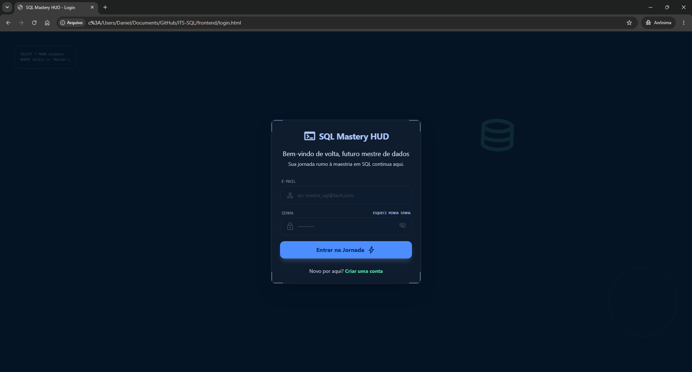
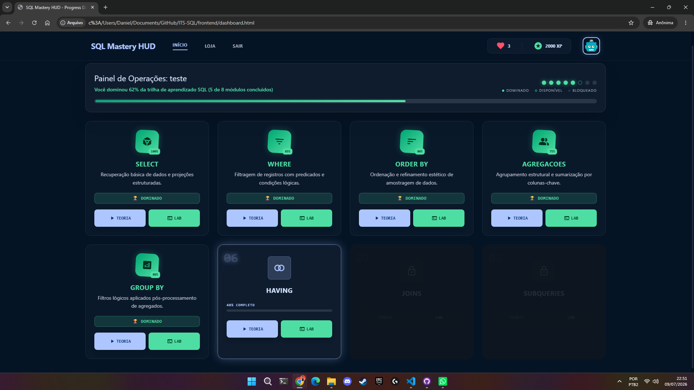
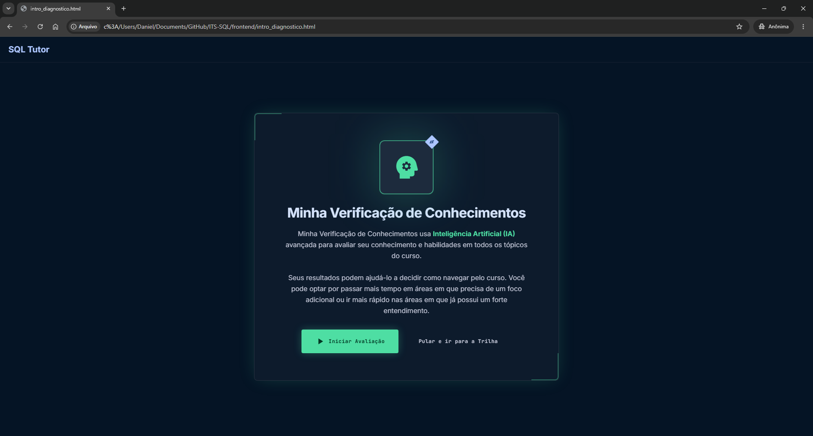
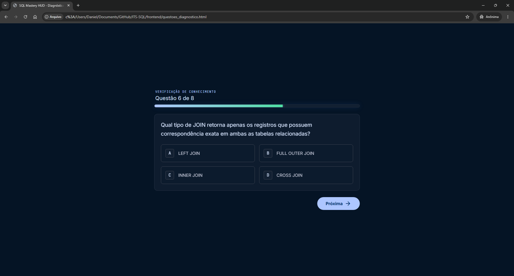
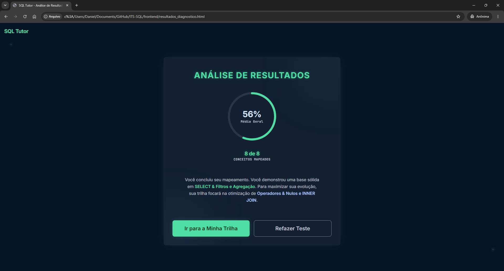
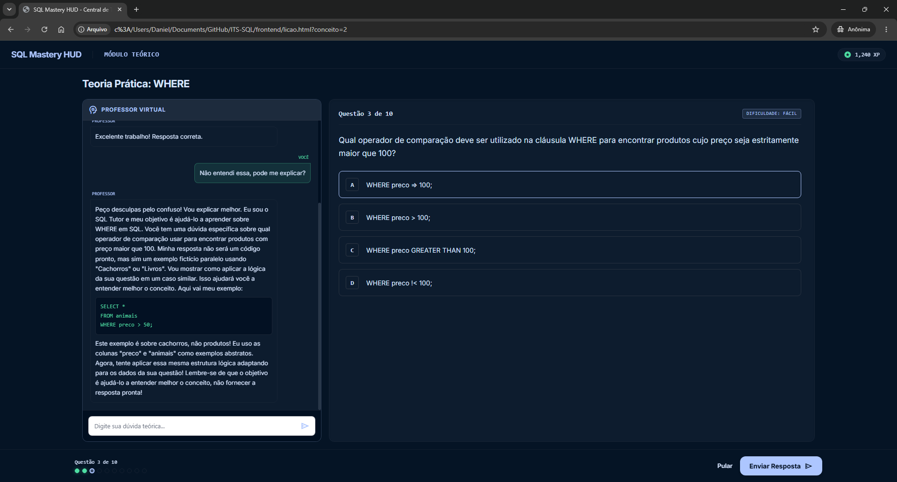
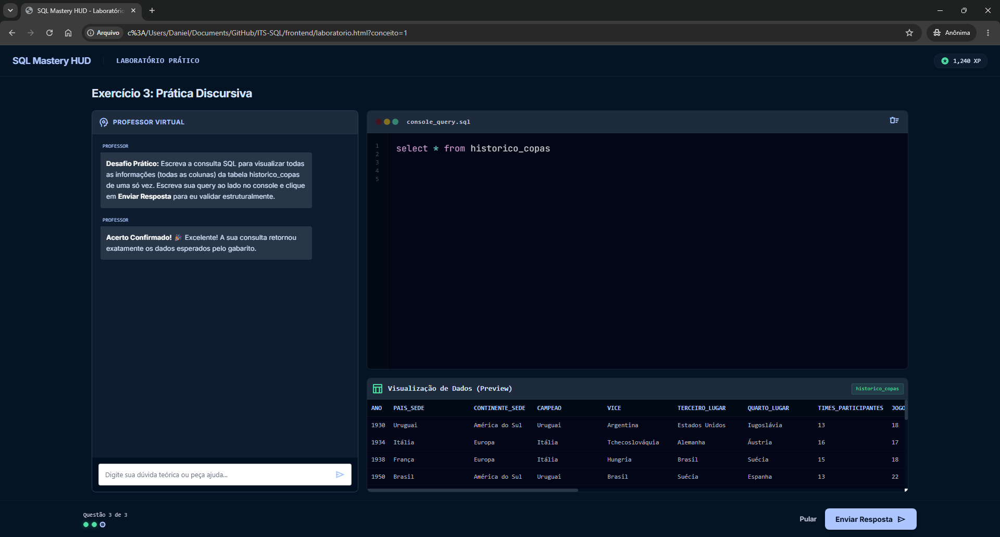
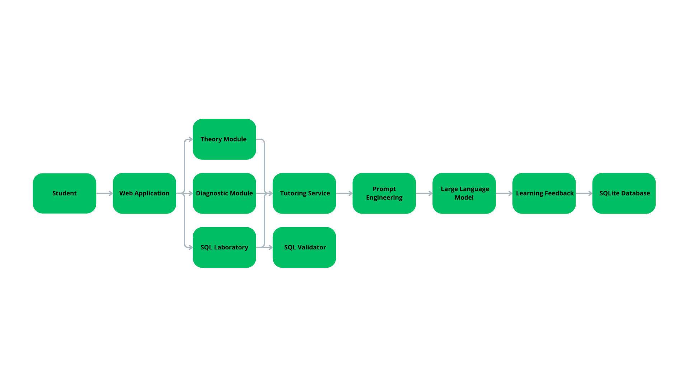
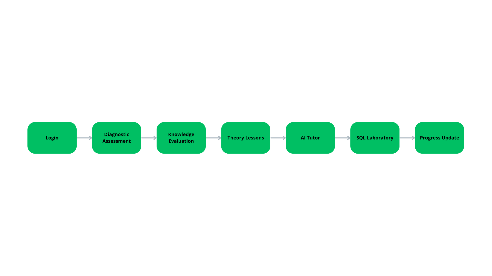
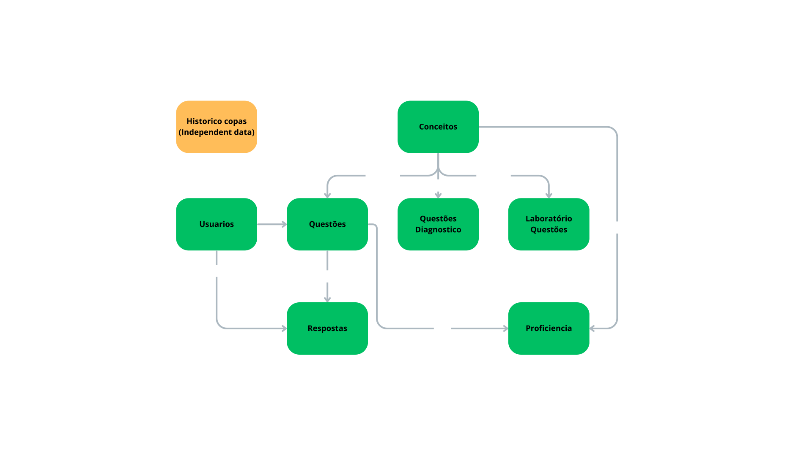

# 🧠 SQL Intelligent Tutor

[]()
[]()
[]()
[]()
[]()

An Intelligent Tutoring System (ITS) designed to teach SQL through adaptive learning, personalized assessments, and AI-assisted tutoring.

The platform combines diagnostic evaluation, theoretical lessons, practical SQL laboratories, and Large Language Models (LLMs) to create a personalized learning experience.

## 📖 Overview

SQL Intelligent Tutor is an Intelligent Tutoring System developed to support SQL education through adaptive learning techniques.

Unlike traditional learning platforms, the system first evaluates the student's knowledge using a diagnostic assessment and then recommends personalized learning paths.

Students can interact with an AI Tutor, practice SQL queries using a real database, and monitor their learning progress throughout the course.

## ✨ Features

- Adaptive Diagnostic Assessment
- Personalized Learning Paths
- LLM-assisted SQL Tutor
- Interactive SQL Laboratory
- Automatic Answer Validation
- Student Progress Tracking
- REST API with FastAPI
- SQLite Database
- Modular Architecture

## 📸 Screenshots

### Login

<p align="center">

</p>

### Dashboard

<p align="center">

</p>

### Diagnostic Assessment

<p align="center">

</p>

### Diagnostic Questions

<p align="center">

</p>

### Diagnostic Results

<p align="center">

</p>

### AI Tutor

<p align="center">

</p>

### SQL Laboratory

<p align="center">

</p>

## 🏗 System Architecture

<p align="center">

</p>

The application follows a modular client-server architecture composed of:

- Web Frontend
- FastAPI Backend
- AI Tutor Service
- SQLite Database
- SQL Learning Modules

## 📚 Learning Workflow

<p align="center">

</p>

The learning process follows these steps:

1. Student authentication
2. Diagnostic assessment
3. Knowledge estimation
4. Personalized lesson recommendation
5. AI-assisted tutoring
6. SQL laboratory practice
7. Progress update

## 🗄 Database Architecture

<p align="center">

</p>

The database stores:

- Users
- SQL concepts
- Diagnostic questions
- Learning questions
- Laboratory exercises
- Student proficiency
- Student answers
- FIFA World Cup dataset

## 🛠 Tech Stack

### Backend

- Python
- FastAPI
- SQLite

### Frontend

- HTML
- CSS
- JavaScript

### Artificial Intelligence

- Meta Llama 3 8B
- Ollama
- Prompt Engineering
- Context-aware Prompt Construction

The tutoring module integrates a Large Language Model (LLM) to provide contextual explanations during SQL learning.

The model receives:

- Student question
- Current lesson
- SQL concept
- Laboratory context

and generates educational feedback tailored to the current activity.

### Development

- Git
- VS Code

## 📁 Project Structure

```text
sql-ai-tutor/

├── assets/
├── backend/
├── frontend/
├── docs/
├── README.md
├── requirements.txt
└── LICENSE
```

## 🚀 Installation

Clone the repository.

```bash
git clone https://github.com/Daniel-Lmv/sql-ai-tutor.git
```

Install the dependencies.

```bash
pip install -r requirements.txt
```

Run the FastAPI backend.

```bash
uvicorn backend.main:app --reload
```

Open the frontend in your browser.

## 📖 Documentation

Detailed documentation is available inside the `docs` folder.

- Architecture
- Database Design
- REST API

## 🔬 Future Improvements

- Docker deployment
- PostgreSQL support
- RAG-based tutoring
- Conversation memory
- Instructor dashboard
- Learning Analytics Dashboard
- Multi-course support
- Automatic exercise generation

## 👨‍💻 Author

**Daniel Limaverde da Silva**

Artificial Intelligence Student

Federal University of Rio Grande do Norte (UFRN)

GitHub: https://github.com/Daniel-Lmv

LinkedIn: www.linkedin.com/in/daniel-limaverde

## ⭐ Support

If you found this project useful, consider giving it a star.

Contributions and suggestions are welcome.
